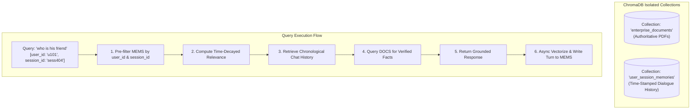
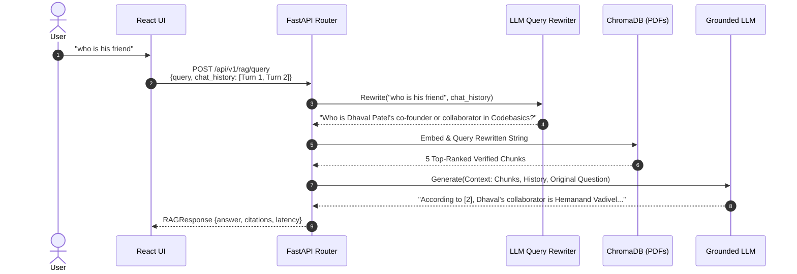
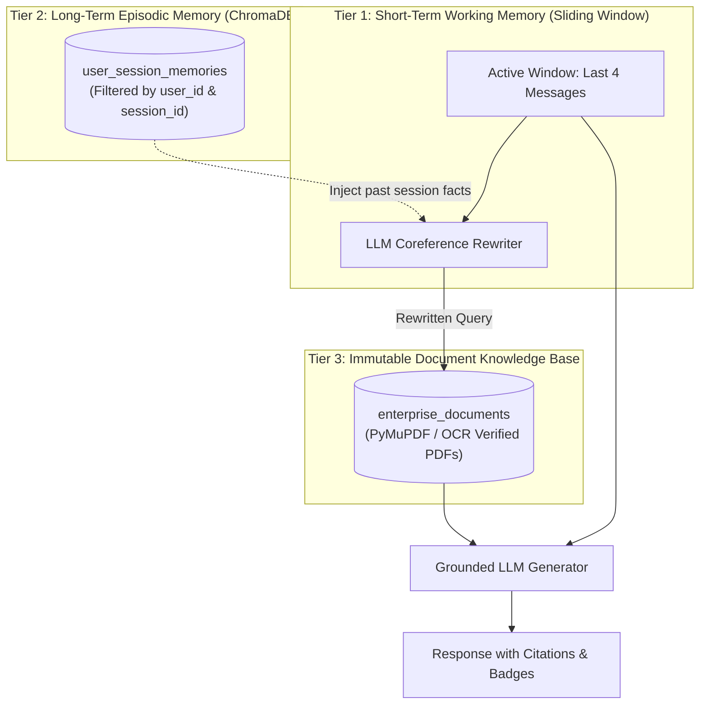

# 🧠 Conversational Memory & Coreference Resolution Architecture

This technical design document captures the architectural analysis, trade-off evaluation, and implementation blueprints for adding **Conversational Memory and Multi-Turn Coreference Resolution** to the **OmniDoc Intelligence Hub**.

---

## 1. Executive Context & Problem Statement

### The Stateless Retrieval Limitation
In the default Phase 7–10 stateless RAG implementation:
* **The Symptom**: When a user asks an initial question (*"Who founded Codebasics?"*), the system answers correctly. However, follow-up queries using pronouns or conversational abbreviations (*"who is his friend"*, *"who is his partner in crime"*) trigger the **Anti-Hallucination Policy Abstention Guardrail**.
* **The Root Cause**: 
  1. The API endpoint `POST /api/v1/rag/query` treats each incoming request as an isolated single-turn interaction.
  2. The dense vector embedder (`bge-m3`) embeds `"who is his friend"` in isolation.
  3. In high-dimensional semantic space, `"who is his friend"` has large cosine distance from the document chunk *"Dhaval Patel founded Codebasics in 2016"*.
  4. Because the similarity score falls below the confidence cutoff ($0.25$), the system safely refuses to speculate.

---

## 2. Approach A: Vector-Based Chronological Session Memory (Episodic Memory)

### Core Concept
Every conversation turn (user prompt + assistant answer) is embedded as a vector and saved into a dedicated, session-partitioned vector collection.



### Metadata Schema for Session Segregation
```json
{
  "id": "mem_u101_s404_turn_003",
  "document": "User: Who founded Codebasics?\nAssistant: Dhaval Patel founded Codebasics in 2016.",
  "metadata": {
    "user_id": "u_101",
    "session_id": "sess_404",
    "turn_index": 3,
    "timestamp_unix": 1774164800,
    "timestamp_iso": "2026-04-15T14:30:00Z",
    "speaker": "dialogue_pair"
  }
}
```

### Time-Decayed Scoring Formula
When querying past interactions, relevance balances semantic proximity with chronological recency:

$$\text{Memory Score} = \alpha \cdot \text{CosineSimilarity}(q, m) + (1 - \alpha) \cdot e^{-\lambda \cdot (t_{\text{now}} - t_{\text{event}})}$$

* **$\alpha$ (Weight Factor)**: Typically set to $0.60$ for semantic match, $0.40$ for recency.
* **$\lambda$ (Decay Parameter)**: Controls how rapidly old turns lose priority over active ones.

---

## 3. Approach B: Sliding-Window Contextual Query Rewriting

### Core Concept
The client (or Redis session cache) transmits the last $N=4$ turns in the request. A lightweight LLM pre-processing step rewrites pronouns into standalone entity names *before* performing vector search.



### Prompt Engineering for Query Rewriter
```text
Given the following conversation history and a follow-up user question, rewrite the follow-up question into a standalone, unambiguous search query that replaces all pronouns (he, she, his, it, they, this) with specific named entities from the conversation.
Do NOT answer the question. Only output the rewritten search query.

Conversation History:
{chat_history}

Follow-up Question: {query}
Standalone Search Query:
```

---

## 4. Comprehensive Engineering Comparison Matrix

| Dimension | Approach A: Vector Session Memory | Approach B: Sliding-Window Query Rewriting |
|---|---|---|
| **Primary Sweet Spot** | **Long-Term Episodic Recall** (cross-session recall across weeks). | **Short-Term Conversational Flow** (immediate pronoun resolution). |
| **Pronoun Accuracy** | ⚠️ Moderate (relies on semantic vector match of ambiguous strings). | 🟢 **Exceptional (100% deterministic entity substitution).** |
| **Write Amplification** | ⚠️ High (writes & re-indexes vector graph on every single message). | 🟢 **Zero Writes** (stateless in-memory execution). |
| **Query Latency** | ⚠️ Higher ($+400\text{ms} - 800\text{ms}$ for embed + write + search). | 🟢 **Lower** ($+100\text{ms} - 150\text{ms}$ for 10-token rewrite). |
| **Risk of Data Pollution** | ⚠️ Risk of indexing LLM hallucinations if not strictly segregated. | 🟢 **Zero Pollution** (chat never enters the vector store). |
| **Memory Lifespan** | 🟢 Infinite (persists across reboots and browser refreshes). | ⚠️ Limited to active session buffer ($N=4$ turns). |
| **Multi-Tenancy** | Requires strict `where={"$and": [{"user_id": ...}]}` indexing. | Inherently isolated per HTTP request payload. |

---

## 5. The Production Hybrid Architecture (The 2-Tier Standard)

Enterprise systems (e.g., ChatGPT Plus, Enterprise Co-Pilots) integrate **both architectures** into a unified 2-Tier memory pipeline:



1. **Tier 1 (Working Memory)**: Handles the immediate 5-minute active conversation using sliding-window query rewriting for fast, zero-latency pronoun resolution.
2. **Tier 2 (Episodic Memory)**: Stores summarized session milestones in `user_session_memories` for recall when users return days or weeks later.
3. **Tier 3 (Ground Truth)**: Pure `enterprise_documents` collection containing only immutable PDF vector chunks.

---

## 6. Implementation Code Reference

### 1. Updated API Request Schema (`backend/api/routers/rag.py`)
```python
from pydantic import BaseModel
from typing import Optional, List

class ChatTurn(BaseModel):
    role: str  # "user" | "assistant"
    content: str

class QueryRequest(BaseModel):
    query: str
    chat_history: Optional[List[ChatTurn]] = []
    top_k: Optional[int] = 4
    similarity_threshold: Optional[float] = 0.25
```

### 2. Coreference Rewriting Integration (`backend/rag/service.py`)
```python
def execute_conversational_query(self, query: str, chat_history: List[ChatTurn] = None) -> RAGResponse:
    # 1. Resolve pronouns if chat history is provided
    search_query = query
    if chat_history and len(chat_history) > 0:
        search_query = self.rewrite_query(query, chat_history)
        
    # 2. Retrieve authoritative chunks using rewritten query
    retrieved_chunks = self.retrieve_chunks(search_query)
    
    # 3. If no chunks meet threshold, safely abstain
    if not retrieved_chunks:
        return RAGResponse(
            query=query,
            answer="I could not find relevant information in the enterprise documents to answer your query.",
            citations=[],
            is_grounded=False,
            abstained=True
        )
        
    # 4. Generate grounded synthesis with citations
    return self.synthesize_grounded_answer(query, search_query, retrieved_chunks, chat_history)
```

---

## 7. Versioning & References
* **Document Status**: Approved Engineering Reference
* **Related Documentation**: [`PROJECT_DOCUMENTATION.md`](file:///home/bhupendra/Desktop/doc-intel-hub/PROJECT_DOCUMENTATION.md), [`TODOS.md`](file:///home/bhupendra/Desktop/doc-intel-hub/TODOS.md)
* **Target Milestone**: Phase 11 Conversational Intelligence
